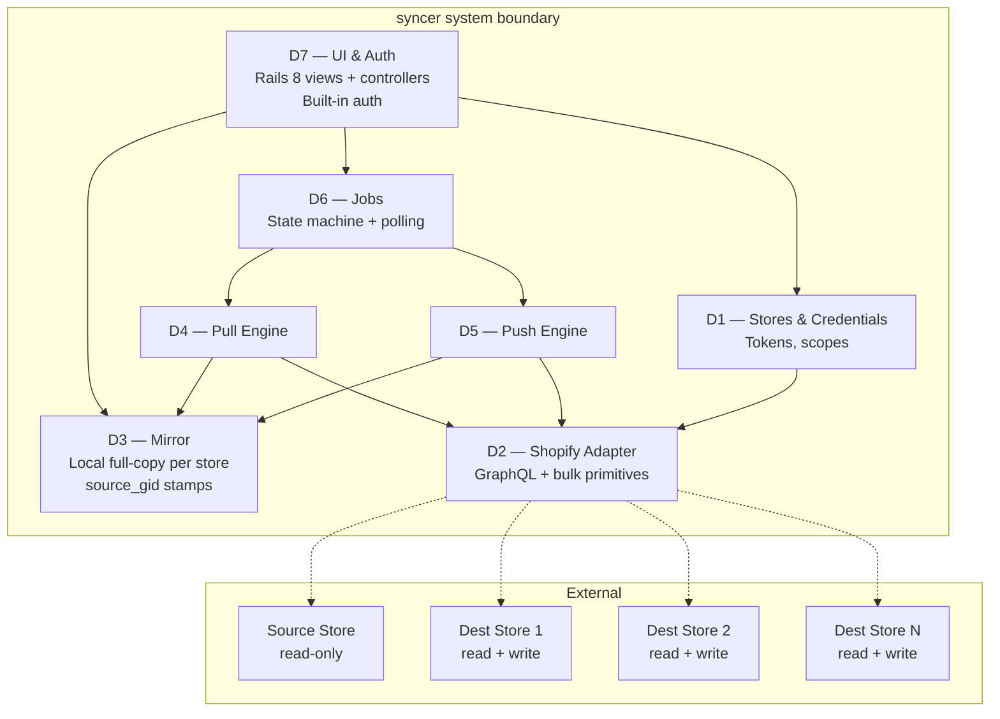

# shopify-dev-store-syncer — Domain Breakdown

**Project:** Open-source Ruby on Rails (Rails 8) developer tool for one-way data sync from a source Shopify store to N destination dev stores.
**Repo:** [stevefritz/shopify-dev-store-syncer](https://github.com/stevefritz/shopify-dev-store-syncer)
**Distribution model:** Self-hosted. Each user clones, creates one Dev Dashboard app, installs it on their source + dest stores via the Dev Dashboard, pastes the app's Client ID + Secret into the Rails UI once, then adds each store by `myshopify.com` domain.
**Spec reference:** Raw Spec Notes v2 (internal) — source of truth for scope, phase plan, API decisions.

---

## Executive summary

The syncer copies catalog data one-way from a production Shopify store into any number of dev stores. It fills a gap Shopify doesn't address natively and that tools like Matrixify solve awkwardly: developers need dev stores to mirror a realistic catalog so their builds exercise real edge cases, without risk of dev work leaking back to production.

The system is decomposed into six bounded domains sharing a single Shopify adapter. **Mirror** (D3) is the hub — every other domain flows around it. **Push Engine** (D5) is the complexity concentrator: the 8-phase pipeline, the translation-table spine, the locale pre-flight, and the one-way stamping guarantee all live here. **Pull Engine** (D4) is D5's simpler inverse. **Jobs** (D6) is the only long-lived state holder and the UI's only entry point into async work. **Stores & Credentials** (D1) and **UI & Auth** (D7) are the outer boundaries.

There is no hardware, no multi-tenancy, no real-time collaboration, and no cross-store write risk — the `$app:p2d.source_gid` stamping rule enforces one-way at the data layer.

Solid arrows = call/dependency. Dashed arrows = Shopify HTTP.

---

## D1: Stores & Credentials

The boundary between the syncer and Shopify's identity system. Holds the one set of app-level credentials, the list of stores the app is installed on, and the per-store access tokens it mints and refreshes via the **client credentials grant**. Also validates that each install carries the scopes the syncer needs.

**Why client credentials grant.** As of January 1, 2026 Shopify stopped accepting new legacy admin-created custom apps (the `shpat_...` long-lived token flow). Dev Dashboard apps using client credentials grant are the only path for new self-owned, multi-store automation like this. No OAuth redirect, no install link, no refresh token — the user installs the app on each of their own stores from the Dev Dashboard UI, and the syncer exchanges Client ID + Secret for a 24-hour access token per store on demand.

**Registration flow.**
1. **Once per syncer install:** user creates one Dev Dashboard app, releases a version pinned to API version 2026-01 with the required scopes, copies **Client ID + Client Secret** from Settings, and pastes them into the syncer's one-time "App credentials" screen. Stored encrypted.
2. **Once per store:** user installs the app on each of their stores via the Dev Dashboard ("Home → Install app → pick store"). Then in the syncer, they click "Add store", enter the `myshopify.com` domain, and tag it `source` or `destination`. The syncer hits `POST https://{shop}.myshopify.com/admin/oauth/access_token` with `grant_type=client_credentials` + the app creds, receives `{access_token, scope, expires_in: 86399}`, validates with a trivial `query { shop { name } }`, and caches the token with its expiry.
3. **At runtime:** before each Shopify call (or on 401), D1 returns a token that's still valid, re-calling the token endpoint if it's within a refresh window. A single installation can have exactly one source store at a time; N destinations.

| | |
|---|---|
| **Entities owned** | AppCredential (singleton — `client_id`, `client_secret` encrypted), Store (`shop_domain`, `role`, `scopes_granted`), StoreToken (`access_token` encrypted, `expires_at`, `last_validated_at`), Validation Event |
| **Capabilities** | App-creds entry (one-time); store CRUD by domain; token minting + caching + refresh via client credentials grant; scope mismatch detection against required scope set; source/dest role assignment; validation via `shop { name }` query |
| **Screens (~3)** | App credentials (one-time setup), store list, add-store form (domain + role, with scope explanation and install link back to Dev Dashboard if scopes missing) |
| **API surface** | Exposes `Store.active_access_token(id)` (refreshes transparently when near expiry), `Store.all(role:)`, and `AppCredential.configured?` to D2 and the UI. Validates on store add, on scope mismatch, and on a schedule. |
| **Consumes from others** | Nothing internal |
| **External integrations** | Shopify token endpoint (`/admin/oauth/access_token`, client credentials grant); Shopify Admin GraphQL (`shop { name }` for validation) |
| **Observability / audit** | Token-mint / refresh / 401 events; credential validation events (success / failure / scope mismatch); last-validated-at and token-expires-at per store; no logging of token, client_id, or client_secret values |
| **Open questions** | Refresh trigger: proactive (background job near expiry) vs. lazy (on next use). Lazy is simpler; proactive avoids latency spikes on first call after idle. Start lazy, revisit if users hit 401 latency in practice. |

---

## D2: Shopify Adapter

Cross-cutting. The single place in the codebase that speaks HTTP to Shopify. Every domain that touches Shopify goes through D2; no domain constructs GraphQL calls or bulk operation mutations itself.

The adapter exposes three primitive shapes: **one-shot queries** (synchronous GraphQL), **bulk queries** (submit → poll → download JSONL → return), and **bulk mutations** (submit JSONL → poll → download result JSONL → return). It owns token refresh, rate-limit detection on one-shot calls, bulk operation lifecycle (submit / poll / cancel / fetch URL), and error translation (Shopify's `userErrors` + HTTP errors → Ruby exception hierarchy).

| | |
|---|---|
| **Entities owned** | BulkOperation (persistent — lifecycle tracked across requests), AdapterError hierarchy |
| **Capabilities** | GraphQL query + mutation execution; `bulkOperationRunQuery` submit + poll + fetch; `bulkOperationRunMutation` submit (JSONL upload via `stagedUploadsCreate`) + poll + fetch; token refresh via client credentials grant; API version pinning (2026-01); consistent error translation |
| **Screens** | 0 (cross-cutting library) |
| **API surface** | Exposed to D3 (Mirror — for incremental reads if needed), D4 (Pull), D5 (Push). Methods are store-scoped: `Shopify.for(store).run_query(...)`, `Shopify.for(store).submit_bulk_query(...)`, etc. |
| **Consumes from others** | D1 (current access token, refresh on 401) |
| **External integrations** | Shopify Admin GraphQL API (2026-01), Shopify bulk operation result CDN, Shopify staged upload endpoints |
| **Observability / audit** | Every GraphQL call logged with cost, throttle status, and timing. Every bulk operation tracked by Shopify op ID + our internal ID. Errors emit structured events. |
| **Open questions** | None load-bearing. Polling lives in Solid Queue jobs (per D6). |

---

## D3: Mirror

The hub. The full local copy of every store the user has connected — source and destinations both. Every other domain either writes into Mirror (D4), reads from Mirror (D5, D7), or doesn't interact with it at all (D1, D2).

Each row is scoped by `store_id`. Mirror rows for destination stores carry a `source_gid` column — the value of the `$app:p2d.source_gid` metafield stamped during push — which makes the matching rule queryable locally without re-fetching from Shopify. This column is also what enables orphan reconciliation (Phase 6) without a Shopify round-trip.

| | |
|---|---|
| **Entities owned** | Product, Variant, Image, Metafield, Collection, CollectionMembership, Metaobject, MetafieldDefinition, MetaobjectDefinition, Translation, ShopLocale. Each scoped to a Store. |
| **Capabilities** | Bulk ingest from JSONL (schema-by-schema upsert); per-store browse; cross-store diff (source vs dest); "find everything I stamped with source_gid X" lookup; freshness marking (last-pulled-at per table per store); safe destructive refresh (truncate + reload for a single store) |
| **Screens (~4)** | Per-store mirror browser: products, collections, metaobjects, translations. Minimal — primarily for verification, not day-to-day use |
| **API surface** | Exposed to D4 (write into), D5 (read from source, write stamps on dest), D7 (read for display). Shape: Rails ActiveRecord models with scopes (`Mirror::Product.for_store(s).stamped`) |
| **Consumes from others** | Nothing at runtime (other than D1 for store identity) |
| **External integrations** | None (pure local DB) |
| **Observability / audit** | Last-pulled-at per (store, resource_type). Row-count deltas on each ingest. Stamp-count on dest stores after each push. |
| **Open questions** | Whether variant-level denormalization (variant metafields as columns on Variant vs rows in Metafield) is worth the query-plan simplification for the 5–10 most-accessed metafields. Defer until a real catalog shows the query patterns. |

---

## D4: Pull Engine

The inverse of D5 and much simpler. Takes a store, figures out which bulk queries it needs to run to get a complete mirror snapshot, submits them in parallel (within Shopify's 5-concurrent limit), polls, downloads the JSONL results, stitches multi-query results together (e.g. variant metafields from a separate query), and upserts into Mirror.

**Pull plan per store.** Four parallel bulk queries cover the catalog: (1) products with variants + media + product metafields, (2) productVariants with their metafields separately (due to the 2-level nesting limit), (3) collections with rules and memberships, (4) metaobjects by type. Translations come via a fifth query against `translatableResources`. Metafield + metaobject *definitions* come via regular (non-bulk) queries since the volume is trivial.

| | |
|---|---|
| **Entities owned** | PullPlan (in-memory), PullJob (delegated to D6 for lifecycle) |
| **Capabilities** | Compose bulk query strings for a store; submit + poll + fetch all queries in parallel; parse JSONL into typed records; stitch variant metafields into parent products; write into Mirror; handle partial failures |
| **Screens** | 0 (triggered from D7 store detail; status shown via D6) |
| **API surface** | Exposed to D6 (delegated): `Pull.plan(store)`, `Pull.run(plan)`. Internal only. |
| **Consumes from others** | D2 (Shopify Adapter), D3 (Mirror writes), D1 (store identity) |
| **External integrations** | None directly (through D2) |
| **Observability / audit** | Per-query bulk op IDs, byte counts, row counts, stitch warnings (orphaned variant metafields, etc.) |
| **Open questions** | Should pulls be incremental by default after the first one, using Shopify's `updated_at` filters? Not v1. |

---

## D5: Push Engine

The complexity concentrator. An 8-phase pipeline that reads from source Mirror, translates GIDs through in-memory lookup tables, submits bulk mutations to a destination store, parses results, and writes stamps back into the destination Mirror. The one-way guarantee is enforced here: every mutation input includes a `source_gid` stamp on any record we create; the orphan reconciliation phase only touches records carrying our stamp.

**Phase pipeline.** Strictly ordered. Phase N cannot start until phase N-1 completes, because each phase builds a translation table used by later phases.

| # | Phase | Mutation | Bulk? |
|---|---|---|---|
| 0 | Metafield definitions | `metafieldDefinitionCreate` | No |
| 1 | Metaobject definitions | `metaobjectDefinitionCreate` | No |
| 2 | Metaobject instances | `metaobjectUpsert` | Yes |
| 3 | Products | `productSet` | Yes |
| 4 | Variant metafields | `productVariantsBulkUpdate` | Yes |
| 5a | Manual collections | `collectionCreate` / `collectionUpdate` | Yes |
| 5b | Smart collections | `collectionUpdate` with `ruleSet` | Yes |
| 6 | Orphan reconciliation | bulk query + policy action | Yes |
| 7 | Translations | `translationsRegister` | Yes |

**Translation tables (the spine).** Every phase that references a GID from an earlier phase looks it up in a table keyed on `source_gid → dest_gid`: `metafield_definition_ids`, `metaobject_type_ids`, `metaobject_instance_ids`, `product_and_variant_ids`, `collection_ids`. **Tables are rebuilt from Mirror's `dest_gid` columns at each phase start** — working memory is a cache, Mirror is the source of truth. This is what makes resume free: after a crash, the next phase just re-reads Mirror and keeps going. Stamps are written to Mirror at phase end (the "stamped" state transition in D6), so a crash after stamping but before phase-complete is safely idempotent.

**Delta-input idempotency.** Every phase computes its JSONL input as `scope_records MINUS Mirror::*.where(source_gid: present, for dest store)`. Already-stamped records are excluded. This means:
- **Resume after crash:** re-entering a half-done phase only pushes the unfinished tail.
- **Retry on transient failure:** failed rows weren't stamped (stamping only happens on success), so they're naturally re-included in the next retry's input. No separate retry path.
- **Re-running a completed phase:** a no-op; input is empty.

The normal input-build path *is* the resume path. No special-case code.

**Locale pre-flight (phase 7 specific).** Before translations run, the engine compares source locales to dest locales. If mismatch, the job pauses and surfaces three choices to the user: enable missing locales automatically, skip missing-locale translations, or cancel the translation phase entirely. This is the only phase that requires human-in-the-loop.

**Mirror staleness is informational, not enforced.** The sync-builder UI surfaces `last_pulled_at(source)` prominently next to the Push button; user decides whether to pull first. No `StaleMirror` error, no threshold config — it's a dev tool, user has judgment.

**Phase 6 orphan policy is a value object, not an enum.** Phase 6 takes an `OrphanPolicy` object whose `decide(orphan) -> action` method is called per orphan. v1 ships three canonical policies (`ignore`, `tag`, `mirror`) and defaults `Push.plan(scope, orphan_policy: OrphanPolicy.new(:ignore))`. Same signature supports future extensions without touching D5/D6/D7: dry-run (`:would_tag` etc.), per-resource-type splits, age-based filters. `:mirror` (destructive) is never the default and only reachable by the UI passing it in explicitly — no global "always mirror" setting.

| | |
|---|---|
| **Entities owned** | PushPlan, PushJob (delegated to D6), PhaseRun (per-phase state), TranslationTable (per-job, persisted) |
| **Capabilities** | Plan phases for a scope; execute phase-by-phase; build translation tables (rebuilt from Mirror at each phase start); generate JSONL input for each bulk mutation using delta-input idempotency (scope minus already-stamped); stamp source_gid on every created record; handle locale pre-flight pause/resume; parse per-line errors from result JSONL; route each error through the `OrphanPolicy` / retry policy / `RETRY_AFTER_CHANGE` surface; surface per-item failures in Mirror + UI |
| **Screens (~3)** | Sync builder (scope selection), job detail with phase-by-phase progress, locale pre-flight dialog |
| **API surface** | Exposed to D6: `Push.plan(scope)`, `Push.run(plan)`, `Push.resolve_preflight(answer)`. Writes source_gid stamps into D3 Mirror. |
| **Consumes from others** | D2 (Shopify Adapter), D3 (Mirror source reads + dest stamp writes), D1 (store identity) |
| **External integrations** | None directly (through D2) |
| **Observability / audit** | Per-phase: bulk op IDs, input row count, success count, per-line error list, timing. Per-job: total items created, total items updated, orphans handled (and how), translations registered. Every stamp traced to job + phase. |
| **Open questions** | JSONB value-schema lock (one migration-#1 design pass). Maximum bulk op timeout before auto-cancel (trivial: pick a number, revisit). |

---

## D6: Jobs

The only domain that holds state across requests. Manages the lifecycle of pull and push jobs — queued → running → paused (for user input) → running → completed / failed — and the polling loop that advances long-running work.

**Pull and push as the same state machine.** Both are shaped identically from the user's perspective: submit, watch status, see result. The differences (phase count, pause conditions, per-item errors) are encapsulated by the delegate (D4 or D5). D6 doesn't know what a "phase" is — it just polls whatever the delegate tells it to poll and advances state accordingly.

**Polling strategy.** Solid Queue (Rails 8 native). One queue for `poll_bulk_op` jobs that wake every N seconds while an op is in flight; one queue for `advance_phase` jobs that run after a phase's stamping completes.

**Resume protocol.** Per-phase state machine, not just per-job: `pending → input_built → submitted(op_id) → polling → fetched → stamped → done`. Every transition is a durable commit. On Rails boot, a reconciler walks every non-terminal Job, loads each PhaseRun's current state, and advances:
- `submitted` / `polling` — poll Shopify for the op, continue based on status
- `fetched` — re-fetch the result JSONL (on Shopify's CDN ~48h) and resume stamping
- `input_built` but not `submitted` — discard partial work, rebuild input as delta against Mirror stamps, resubmit
- `stamped` — advance phase counter, enqueue next phase

If a job is paused beyond Shopify's ~48h bulk-op retention, the reconciler surfaces a "too stale — re-run phase N?" action. Because input is always a delta against Mirror, re-running only does unfinished work.

| | |
|---|---|
| **Entities owned** | Job (pull or push), PhaseRun (per-phase state + current step), BulkOperation (Shopify op ID, result URL, status), JobEvent (audit trail), UserInput (pending pre-flight answer) |
| **Capabilities** | Job lifecycle state machine; per-phase state machine (`pending → input_built → submitted → polling → fetched → stamped → done`); delegate to D4 or D5 for type-specific work; Solid Queue–driven polling; pause on user input or missing-locale pre-flight, resume on answer; boot-time reconciler that advances every non-terminal job based on current PhaseRun state and Shopify's view of each bulk op; emit events for UI live updates |
| **Screens (~3)** | Job list, job detail, job result summary |
| **API surface** | Exposed to D7: `Jobs.create_pull(store)`, `Jobs.create_push(scope)`, `Jobs.answer(job, input)`, `Jobs.cancel(job)`. Live updates via Turbo Streams. |
| **Consumes from others** | D4 (delegate for pulls), D5 (delegate for pushes) |
| **External integrations** | None directly |
| **Observability / audit** | Every job event persisted (created, phase-started, phase-completed, paused, resumed, failed, completed). Audit is the product — a full trace of every sync is the user's debugging tool. |
| **Open questions** | None load-bearing. Secondary: retry back-off curve (exponential vs fixed) — start fixed, change if it bites. |

---

## D7: UI & Auth

The Rails 8 presentation layer. Built-in authentication (`rails generate authentication`); first admin user seeded from ENV vars on first run (`ADMIN_EMAIL` + `ADMIN_PASSWORD`); additional users optionally added via the UI. No Devise, no third-party gems for auth.

**Screen inventory (estimate ~15).** Login; Dashboard (all stores + recent jobs); Store list; Store detail; Add store; Mirror browser per store (products, collections, metaobjects, translations); Sync builder (scope selection); Job list; Job detail with live phase progress; Locale pre-flight dialog; Settings (user management, app config); Orphan policy confirmation.

| | |
|---|---|
| **Entities owned** | User, Session (Rails 8 auth) |
| **Capabilities** | Login/logout; user management (optional multi-user); form handling for all domains; live job updates via Turbo Streams; scope selector UI (resource-type checkboxes + free-text Shopify query syntax + "just this product" escape hatch); sync builder surfaces source-mirror `last_pulled_at` next to the Push button (informational only); locale pre-flight dialog UI; orphan policy selector (defaults `:ignore`, `:mirror` requires deliberate click) |
| **Screens** | ~15 total — see inventory above |
| **API surface** | None externally. Internally consumes: D1, D3, D6. |
| **Consumes from others** | D1 (stores CRUD), D3 (mirror browsers), D6 (job control + live updates) |
| **External integrations** | None |
| **Observability / audit** | Login events; destructive action confirmations (delete store, mirror policy) logged |
| **Open questions** | Collection-picker UI — deferred to v1.1. Scope-selector v1 ships with checkboxes + free-text query + per-product escape only. |

---

## Cross-cutting concerns

| | Used by | Notes |
|---|---|---|
| **Shopify Adapter** | D3, D4, D5 | D2 above. The single HTTP boundary. High agentic leverage. |
| **Audit logging** | D4, D5, D6 | Every Shopify write and every job event. Structured, queryable, user-facing. |
| **Error and retry policy** | D2, D5, D6 | See §Error and retry policy below. Three-state taxonomy, single lookup table. |
| **Encryption at rest** | D1 | Rails 7+ built-in encrypted attributes for credentials. No third-party gem. |
| **API version pinning** | D2 | Single constant for Shopify API version (2026-01). Upgrades are a deliberate PR. |

---

## Error and retry policy

Every Shopify error maps to one of three actions: `NO_RETRY`, `RETRY_SAME_INPUT`, `RETRY_AFTER_CHANGE`. The mapping is a single constant table in D5 keyed on `(mutation, error_code)`, seeded from Shopify's documented enum values. D5 reads the code, looks up the action, routes. No per-mutation retry logic scattered through phases — the retry decision is a pure function of the error code.

**Three states, three UX buckets:**

| State | System action | User sees |
|---|---|---|
| `RETRY_SAME_INPUT` | Auto-retry up to 3 attempts with fixed back-off. On 3rd failure, promote to `NO_RETRY`. | Nothing unless final attempt fails |
| `RETRY_AFTER_CHANGE` | **No auto-retry.** Failed row surfaced in job result with the Shopify error code as an actionable message. | "Fix at source and re-run" — re-run is a fresh job, not a resume |
| `NO_RETRY` | Permanent failure for this row. Logged as JobEvent. Phase continues with remaining rows. | Failure appears in job detail's failure list |

`RETRY_AFTER_CHANGE` has auto-retry count **zero**. The system doesn't wait for the user to fix anything — it surfaces and moves on. When the user fixes it at source and re-runs, delta-input idempotency (see D5) means only the previously-failed rows are re-submitted.

**Two classifications where the "who changes?" question flips:**

- **`ACCESS_DENIED` (bulk-op level) is job-fatal, not per-line.** It means the store's install lost a scope the app needs. Handler: pause the whole job *for that store*, surface at the D1 store-credential level with a "reinstall with correct scopes" action, leave jobs against other stores unaffected.
- **`NO_SUCH_FILE` (bulk mutation submit) is system-retryable, not user-retryable.** The "change" is re-uploading the JSONL — our responsibility. Handled as `RETRY_SAME_INPUT` with a fresh staged upload, then falls through to `NO_RETRY` if it persists.

**Verification policy (when to re-pull).** On-failure only. When a phase succeeds, we trust the result JSONL and move on. When a phase returns `RETRY_SAME_INPUT` rows, we re-pull only the affected records from dest before the retry attempt. When a phase's bulk op errors fatally (`INTERNAL_SERVER_ERROR`, `TIMEOUT`), we full-pull the phase's touched records to rebuild Mirror before deciding retry vs abort. No post-success verification — that's what the stamping contract is for.

---

## Out of scope

- Pages, blogs, articles, navigation
- Theme content, theme settings
- Customers, orders
- Policies, shop SEO, email templates
- Selling plans, shipping/delivery configs
- Two-way sync or source-of-truth switching
- App Store distribution
- Multi-tenant / hosted offering

---

## Open questions

Grouped by urgency.

**Need resolution before first code**

1. **JSONB value-schema lock** for `Metafield.value` and `MetaobjectField.value` — keys, indexes, casts. Cheap in migration #1, painful later.

**Deferred**

2. Incremental pull via `updated_at` filters.
3. CLI wrapper for scripting re-syncs.
4. Per-error-code actionable UI copy for `RETRY_AFTER_CHANGE` (v1 ships a generic "fix at source" message + Shopify's error code verbatim; curate later).

**Decided**

Solid Queue · Turbo Streams · Postgres · app namespace `p2d` · JSONB for arbitrary metafield values · scope-selector v1 shape (checkboxes + free-text query + single-product escape; collection picker to v1.1) · retry taxonomy (`NO_RETRY` / `RETRY_SAME_INPUT` / `RETRY_AFTER_CHANGE`) · retry back-off fixed 30s · verification = on-failure only · resume-from-phase-N in v1 via delta-input idempotency · Phase 6 orphan policy `OrphanPolicy` value object, default `:ignore`, `:mirror` never global · mirror staleness informational only (no enforcement).

---

## Phase sequencing

Dependency-driven build order.

| Phase | Contents |
|---|---|
| Phase 0 | Resolve the JSONB value-schema lock. Stack is locked: Rails 8 auth, Postgres via docker-compose, Solid Queue, Turbo Streams, app namespace `p2d`. |
| Phase 1 | Foundation — Rails 8 app scaffold, auth generator, ENV-seeded admin, docker-compose with Postgres, base layout |
| Phase 2 | D1 Stores & Credentials + D2 Shopify Adapter in parallel (both foundational; neither depends on the other) |
| Phase 3 | D3 Mirror (schema + ingest API) — unblocks D4 and D5 |
| Phase 4 | D4 Pull Engine — end-to-end pull working against a real source store before D5 starts |
| Phase 5 | D6 Jobs (state machine + polling) — wraps D4, will wrap D5 |
| Phase 6 | D7 UI first pass — enough to trigger + watch pulls |
| Phase 7 | D5 Push Engine — the big phase; phase-by-phase incremental development |
| Phase 8 | D7 UI second pass — push UX, locale pre-flight, mirror browsers |
| Phase 9 | Integration + end-to-end test against a small real catalog |
| Phase 10 | Polish, docs, repo README v1, demo video, launch |

---

## Risk register

| Risk | Likelihood | Impact | Mitigation |
|---|---|---|---|
| `productSet` media reconciliation has edge cases we haven't anticipated | Medium | High | Test against a product with 20+ images early in D5. Budget iteration time. |
| Translation digest handling differs per resource type in subtle ways | Medium | Medium | Register one product's translations end-to-end before expanding to collections / metaobjects. |
| Dev Dashboard client-credentials-grant flow changes again | Low | High | Pin the docs we rely on; monitor Shopify changelog; keep the credential entry UI forgiving enough to handle token format changes. |
| Bulk operation polling + process restarts lose job state | Medium | High | Persist all Shopify op IDs. Every phase boundary is a durable commit. Test by killing the Rails process mid-push. |
| One-way guarantee bug in orphan reconciliation accidentally deletes source records | Low | Catastrophic | Phase 6 only operates on destination stores — hard-code this in the domain boundary, not as a flag. Tests verify it can't be invoked on a source-role store. |
| User pushes against stale mirror, propagates outdated data | Low | Medium | Sync builder surfaces `last_pulled_at(source)` next to the Push button. User judgment, not enforcement. |

---

## Patterns worth noting

- **D3 Mirror is the hub.** Every sync operation becomes a Mirror read or Mirror write. If it's not in Mirror, it doesn't exist as far as the syncer is concerned. This is what makes the system debuggable offline.
- **D4 Pull and D5 Push are mirror images structurally but asymmetric in complexity.** Pulls are one-directional data flow; pushes require translation tables, ordering, and stamping. Do not try to share code between them beyond the D2 adapter primitives.
- **D6 Jobs is the only long-lived state holder.** If a job isn't in D6, it's not happening. UI never runs work directly.
- **Every cross-store ID reference goes through a translation table.** No raw GIDs flow from source context into dest writes without passing through a lookup. This is the single pattern that makes multi-store coordination tractable.
- **Every Shopify write is traceable.** Job ID → Phase → source_gid stamp → destination record. Full provenance.
- **The `$app:p2d.source_gid` stamp is the one-way enforcement mechanism.** It's not a convention; it's a data-layer check baked into Phase 6 (orphan reconciliation only touches records with the stamp) and Phase 3 (stamping happens atomically with creation). The architecture cannot write back to source.

