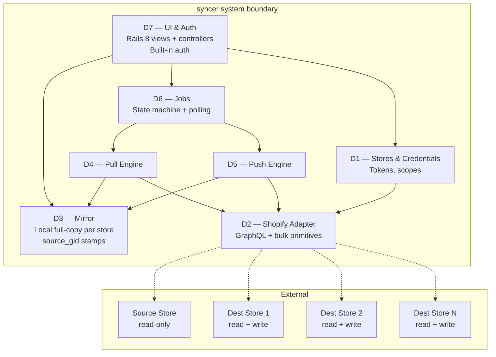

# shopify-dev-store-syncer — Domain Breakdown

**Project:** Open-source Ruby on Rails (Rails 8) developer tool for one-way data sync from a source Shopify store to N destination dev stores.
**Repo:** [stevefritz/shopify-dev-store-syncer](https://github.com/stevefritz/shopify-dev-store-syncer)
**Distribution model:** Self-hosted. Each user clones, creates a Dev Dashboard app, does custom installs to source + dest stores, pastes credentials into the Rails UI.
**Spec reference:** Raw Spec Notes v2 (internal) — source of truth for scope, phase plan, API decisions.

---

## Executive summary

The syncer copies catalog data one-way from a production Shopify store into any number of dev stores. It fills a gap Shopify doesn't address natively and that tools like Matrixify solve awkwardly: developers need dev stores to mirror a realistic catalog so their builds exercise real edge cases, without risk of dev work leaking back to production.

The system is decomposed into six bounded domains sharing a single Shopify adapter. **Mirror** (D3) is the hub — every other domain flows around it. **Push Engine** (D5) is the complexity concentrator: the 8-phase pipeline, the translation-table spine, the locale pre-flight, and the one-way stamping guarantee all live here. **Pull Engine** (D4) is D5's simpler inverse. **Jobs** (D6) is the only long-lived state holder and the UI's only entry point into async work. **Stores & Credentials** (D1) and **UI & Auth** (D7) are the outer boundaries.

There is no hardware, no multi-tenancy, no real-time collaboration, and no cross-store write risk — the `$app:<slug>.source_gid` stamping rule enforces one-way at the data layer. Most of this is textbook agentic work; the exceptions are flagged per domain.

Solid arrows = call/dependency. Dashed arrows = Shopify HTTP.

---

## Estimate

Rough dev-day estimates assuming Ouvrage-dispatched CC workers for most work. Not wall-clock.

| Phase | Days |
|---|---|
| Foundation (Rails 8 app, auth scaffold, DB setup) | 1 |
| D1 Stores & Credentials | 1–2 |
| D2 Shopify Adapter (core + bulk primitives) | 1–2 |
| D3 Mirror (schema + ingest + read API) | 1 |
| D4 Pull Engine (query authoring + JSONL stitching) | 2 |
| D5 Push Engine (phase pipeline, translation tables, stamping) | 4–6 |
| D6 Jobs (state machine + polling + pause/resume) | 1–2 |
| D7 UI & screens | 2–3 |
| Translation phase (subset of D5) | 1–2 |
| Integration + first real sync against live stores | 1–2 |
| **Total** | **15–23 dev days** |

Verification / open items tracked separately — see §Open Questions.

---

## D1: Stores & Credentials

The boundary between the syncer and Shopify's identity system. Holds the records that identify each store the user has connected, manages the client-credentials-grant token lifecycle, and validates that each store's installed app carries the scopes the syncer actually needs.

**Registration flow (sketch).** User creates one app in the Dev Dashboard, performs a custom install to each store they want to sync (source + destinations), and copies the Client ID + Client Secret + admin API access token from each install into the syncer UI. The syncer validates credentials by making a cheap GraphQL call (`shop { name }`) and verifying required scopes are present. The user tags each store as `source` or `destination`. A single installation can have exactly one source store configured at a time; N destinations.

| | |
|---|---|
| **Entities owned** | Store, Credential (encrypted at rest), Scope Set, Validation Event |
| **Capabilities** | Store CRUD; credential entry + encryption; credential validation via trivial GraphQL call; scope mismatch detection; token refresh (client credentials grant); source/dest role assignment |
| **Screens (~3)** | Store list, store detail/edit, add-store form (with scope explanation) |
| **API surface** | Exposes `Store.active_access_token(id)` and `Store.all(role:)` to D2 and the UI. Validates credentials on create and on a schedule. |
| **Consumes from others** | Nothing internal |
| **External integrations** | Shopify token endpoint (client credentials grant exchange); Shopify Admin GraphQL (single query for validation) |
| **Observability / audit** | Credential validation events (success / failure / scope mismatch); credential last-validated-at timestamp; no logging of credential values themselves |
| **Agentic-friendly** | Rails CRUD, encrypted attribute handling (Rails 7+ built-in), simple HTTP client for token exchange, scope list comparison |
| **Agentic-resistant** | Initial testing against a real Dev Dashboard install flow — the path is new (post Jan 2026 deprecation) and Shopify's docs/examples lag. Expect one manual end-to-end test loop per credential type |
| **Open questions** | Whether one app-per-user can span multiple installs cleanly, or whether we need any per-install config beyond what the user pastes in. Verify with a real test install. |

---

## D2: Shopify Adapter

Cross-cutting. The single place in the codebase that speaks HTTP to Shopify. Every domain that touches Shopify goes through D2; no domain constructs GraphQL calls or bulk operation mutations itself.

The adapter exposes three primitive shapes: **one-shot queries** (synchronous GraphQL), **bulk queries** (submit → poll → download JSONL → return), and **bulk mutations** (submit JSONL → poll → download result JSONL → return). It owns token refresh, rate-limit detection on one-shot calls, bulk operation lifecycle (submit / poll / cancel / fetch URL), and error translation (Shopify's `userErrors` + HTTP errors → Ruby exception hierarchy).

| | |
|---|---|
| **Entities owned** | BulkOperation (persistent — lifecycle tracked across requests), AdapterError hierarchy |
| **Capabilities** | GraphQL query + mutation execution; `bulkOperationRunQuery` submit + poll + fetch; `bulkOperationRunMutation` submit (JSONL upload via `stagedUploadsCreate`) + poll + fetch; token refresh via client credentials grant; API version pinning (2026-01); consistent error translation |
| **Screens** | 0 (cross-cutting library) |
| **API surface** | Exposed to D3 (Mirror — for incremental reads if needed), D4 (Pull), D5 (Push). Methods are store-scoped: `Shopify.for(store).run_query(...)`, `Shopify.for(store).submit_bulk_query(...)`, etc. |
| **Consumes from others** | D1 (current access token, refresh on 401) |
| **External integrations** | Shopify Admin GraphQL API (2026-01), Shopify bulk operation result CDN, Shopify staged upload endpoints |
| **Observability / audit** | Every GraphQL call logged with cost, throttle status, and timing. Every bulk operation tracked by Shopify op ID + our internal ID. Errors emit structured events. |
| **Agentic-friendly** | HTTP + string templating + polling loop. All of the core. |
| **Agentic-resistant** | Edge cases against live Shopify — rate-limit header quirks, bulk op state transitions Shopify doesn't fully document, occasional transient 5xx during bulk fetches. Needs at least one iteration against a live store before it's trustworthy. |
| **Open questions** | Does our polling loop live in a worker or in-request? Rails app design depends on this (see §NFR). |

---

## D3: Mirror

The hub. The full local copy of every store the user has connected — source and destinations both. Every other domain either writes into Mirror (D4), reads from Mirror (D5, D7), or doesn't interact with it at all (D1, D2).

Each row is scoped by `store_id`. Mirror rows for destination stores carry a `source_gid` column — the value of the `$app:<slug>.source_gid` metafield stamped during push — which makes the matching rule queryable locally without re-fetching from Shopify. This column is also what enables orphan reconciliation (Phase 6) without a Shopify round-trip.

| | |
|---|---|
| **Entities owned** | Product, Variant, Image, Metafield, Collection, CollectionMembership, Metaobject, MetafieldDefinition, MetaobjectDefinition, Translation, ShopLocale. Each scoped to a Store. |
| **Capabilities** | Bulk ingest from JSONL (schema-by-schema upsert); per-store browse; cross-store diff (source vs dest); "find everything I stamped with source_gid X" lookup; freshness marking (last-pulled-at per table per store); safe destructive refresh (truncate + reload for a single store) |
| **Screens (~4)** | Per-store mirror browser: products, collections, metaobjects, translations. Minimal — primarily for verification, not day-to-day use |
| **API surface** | Exposed to D4 (write into), D5 (read from source, write stamps on dest), D7 (read for display). Shape: Rails ActiveRecord models with scopes (`Mirror::Product.for_store(s).stamped`) |
| **Consumes from others** | Nothing at runtime (other than D1 for store identity) |
| **External integrations** | None (pure local DB) |
| **Observability / audit** | Last-pulled-at per (store, resource_type). Row-count deltas on each ingest. Stamp-count on dest stores after each push. |
| **Agentic-friendly** | Rails models, migrations, ingest parsers, scoped queries. Most of it. |
| **Agentic-resistant** | Schema design decisions — JSONB columns for arbitrary metafield values vs. a polymorphic value table. Settle once, never again. Needs a design pass before CC dispatches migrations. |
| **Open questions** | Postgres or SQLite as default? SQLite fits "clone and run" better for the OSS use case; Postgres handles larger catalogs better. Probably ship with SQLite default, document Postgres upgrade path. |

---

## D4: Pull Engine

The inverse of D5 and much simpler. Takes a store, figures out which bulk queries it needs to run to get a complete mirror snapshot, submits them in parallel (within Shopify's 5-concurrent limit), polls, downloads the JSONL results, stitches multi-query results together (e.g. variant metafields from a separate query), and upserts into Mirror.

**Pull plan per store.** Four parallel bulk queries cover the catalog: (1) products with variants + media + product metafields, (2) productVariants with their metafields separately (due to the 2-level nesting limit), (3) collections with rules and memberships, (4) metaobjects by type. Translations come via a fifth query against `translatableResources`. Metafield + metaobject *definitions* come via regular (non-bulk) queries since the volume is trivial.

| | |
|---|---|
| **Entities owned** | PullPlan (in-memory), PullJob (delegated to D6 for lifecycle) |
| **Capabilities** | Compose bulk query strings for a store; submit + poll + fetch all queries in parallel; parse JSONL into typed records; stitch variant metafields into parent products; write into Mirror; handle partial failures |
| **Screens** | 0 (triggered from D7 store detail; status shown via D6) |
| **API surface** | Exposed to D6 (delegated): `Pull.plan(store)`, `Pull.run(plan)`. Internal only. |
| **Consumes from others** | D2 (Shopify Adapter), D3 (Mirror writes), D1 (store identity) |
| **External integrations** | None directly (through D2) |
| **Observability / audit** | Per-query bulk op IDs, byte counts, row counts, stitch warnings (orphaned variant metafields, etc.) |
| **Agentic-friendly** | Query authoring, JSONL parsing, stitch logic, Mirror upsert. All of it. |
| **Agentic-resistant** | Partial-failure policy — if query 2 of 4 fails, do we Mirror the rest or abort the whole pull? Needs a deliberate call, not CC's default. |
| **Open questions** | Should pulls be incremental by default after the first one, using Shopify's `updated_at` filters? Not v1. |

---

## D5: Push Engine

The complexity concentrator. An 8-phase pipeline that reads from source Mirror, translates GIDs through in-memory lookup tables, submits bulk mutations to a destination store, parses results, and writes stamps back into the destination Mirror. The one-way guarantee is enforced here: every mutation input includes a `source_gid` stamp on any record we create; the orphan reconciliation phase only touches records carrying our stamp.

**Phase pipeline.** Strictly ordered. Phase N cannot start until phase N-1 completes, because each phase builds a translation table used by later phases.

| # | Phase | Mutation | Bulk? |
|---|---|---|---|
| 0 | Metafield definitions | `metafieldDefinitionCreate` | No |
| 1 | Metaobject definitions | `metaobjectDefinitionCreate` | No |
| 2 | Metaobject instances | `metaobjectUpsert` | Yes |
| 3 | Products | `productSet` | Yes |
| 4 | Variant metafields | `productVariantsBulkUpdate` | Yes |
| 5a | Manual collections | `collectionCreate` / `collectionUpdate` | Yes |
| 5b | Smart collections | `collectionUpdate` with `ruleSet` | Yes |
| 6 | Orphan reconciliation | bulk query + policy action | Yes |
| 7 | Translations | `translationsRegister` | Yes |

**Translation tables (the spine).** Every phase that references a GID from an earlier phase looks it up in an in-memory table built during that prior phase: `metafield_definition_ids`, `metaobject_type_ids`, `metaobject_instance_ids`, `product_and_variant_ids`, `collection_ids`. Tables are held in job working memory and persisted to Mirror as `dest_gid` columns for next run.

**Locale pre-flight (phase 7 specific).** Before translations run, the engine compares source locales to dest locales. If mismatch, the job pauses and surfaces three choices to the user: enable missing locales automatically, skip missing-locale translations, or cancel the translation phase entirely. This is the only phase that requires human-in-the-loop.

| | |
|---|---|
| **Entities owned** | PushPlan, PushJob (delegated to D6), PhaseRun (per-phase state), TranslationTable (per-job, persisted) |
| **Capabilities** | Plan phases for a scope; execute phase-by-phase; build translation tables from phase results; generate JSONL input for each bulk mutation; stamp source_gid on every created record; handle locale pre-flight pause/resume; parse per-line errors from result JSONL; surface per-item failures in Mirror + UI; apply orphan policy (ignore / tag / mirror) |
| **Screens (~3)** | Sync builder (scope selection), job detail with phase-by-phase progress, locale pre-flight dialog |
| **API surface** | Exposed to D6: `Push.plan(scope)`, `Push.run(plan)`, `Push.resolve_preflight(answer)`. Writes source_gid stamps into D3 Mirror. |
| **Consumes from others** | D2 (Shopify Adapter), D3 (Mirror source reads + dest stamp writes), D1 (store identity) |
| **External integrations** | None directly (through D2) |
| **Observability / audit** | Per-phase: bulk op IDs, input row count, success count, per-line error list, timing. Per-job: total items created, total items updated, orphans handled (and how), translations registered. Every stamp traced to job + phase. |
| **Agentic-friendly** | Translation-table logic, GID translation, JSONL input generation, per-line error parsing, phase state machine, stamping. Testable math; specs in, code out. |
| **Agentic-resistant** | Locale pre-flight pause/resume across Rails process restarts (needs durable state, not in-memory). Phase ordering when phases partially fail — retry the failed items? Skip? Abort? Needs a deliberate policy per phase. Scope selector interpreting user-entered Shopify query syntax — easy to get subtly wrong. All need iteration against live stores. |
| **Open questions** | Partial-failure policy per phase. Maximum bulk op timeout before auto-cancel. Whether to support "resume from phase N" after a failure. |

---

## D6: Jobs

The only domain that holds state across requests. Manages the lifecycle of pull and push jobs — queued → running → paused (for user input) → running → completed / failed — and the polling loop that advances long-running work.

**Pull and push as the same state machine.** Both are shaped identically from the user's perspective: submit, watch status, see result. The differences (phase count, pause conditions, per-item errors) are encapsulated by the delegate (D4 or D5). D6 doesn't know what a "phase" is — it just polls whatever the delegate tells it to poll and advances state accordingly.

**Polling strategy (design decision needed).** Two options: (a) background worker via Solid Queue (ships with Rails 8; adds a moving part but scales naturally), or (b) cron-driven tick every N seconds that advances all running jobs (simpler, higher-latency, fine for single-user tool). Leaning (a) — Solid Queue is native to Rails 8.

| | |
|---|---|
| **Entities owned** | Job (pull or push), JobEvent (audit trail), BulkOperation link (Shopify-side op ID), UserInput (pending pre-flight answer) |
| **Capabilities** | Job lifecycle state machine; delegate to D4 or D5 for type-specific work; polling loop (advance Shopify bulk ops); pause on user-input requirement, resume on answer; restart recovery (pick up where we left off across process restarts); emit events for UI live updates |
| **Screens (~3)** | Job list, job detail, job result summary |
| **API surface** | Exposed to D7: `Jobs.create_pull(store)`, `Jobs.create_push(scope)`, `Jobs.answer(job, input)`, `Jobs.cancel(job)`. Live updates via Turbo Streams. |
| **Consumes from others** | D4 (delegate for pulls), D5 (delegate for pushes) |
| **External integrations** | None directly |
| **Observability / audit** | Every job event persisted (created, phase-started, phase-completed, paused, resumed, failed, completed). Audit is the product — a full trace of every sync is the user's debugging tool. |
| **Agentic-friendly** | State machine (Rails 8 built-in or `statesman` gem), event emission, polling loop, Rails controllers. |
| **Agentic-resistant** | Pause/resume across Rails process restarts — state must be durable and recovery logic must be correct. Consistent state between our Job records and Shopify's BulkOperation records. Tested against killed workers. |
| **Open questions** | Solid Queue vs GoodJob vs cron. In-memory translation tables surviving a worker restart (answer: they don't — persist to Mirror at end of each phase). |

---

## D7: UI & Auth

The Rails 8 presentation layer. Built-in authentication (`rails generate authentication`); first admin user seeded from ENV vars on first run (`ADMIN_EMAIL` + `ADMIN_PASSWORD`); additional users optionally added via the UI. No Devise, no third-party gems for auth.

**Screen inventory (estimate ~15).** Login; Dashboard (all stores + recent jobs); Store list; Store detail; Add store; Mirror browser per store (products, collections, metaobjects, translations); Sync builder (scope selection); Job list; Job detail with live phase progress; Locale pre-flight dialog; Settings (user management, app config); Orphan policy confirmation.

| | |
|---|---|
| **Entities owned** | User, Session (Rails 8 auth) |
| **Capabilities** | Login/logout; user management (optional multi-user); form handling for all domains; live job updates via Turbo Streams; scope selector UI (dropdown + query syntax + collection picker); locale pre-flight dialog UI |
| **Screens** | ~15 total — see inventory above |
| **API surface** | None externally. Internally consumes: D1, D3, D6. |
| **Consumes from others** | D1 (stores CRUD), D3 (mirror browsers), D6 (job control + live updates) |
| **External integrations** | None |
| **Observability / audit** | Login events; destructive action confirmations (delete store, mirror policy) logged |
| **Agentic-friendly** | Rails 8 controllers + ERB views + Stimulus + Turbo; form handling; scope selector; standard stuff. |
| **Agentic-resistant** | Real-time job status updates (Turbo Streams config + testing); interactive locale pre-flight dialog that cleanly blocks-then-resumes server-side work; scope selector UX (needs iteration); mobile responsiveness (syncer is desktop-first but shouldn't break on mobile). |
| **Open questions** | Turbo Streams vs. ActionCable for live updates — Turbo Streams is simpler and ships native; ActionCable is more flexible. Leaning Turbo Streams for v1. |

---

## Cross-cutting concerns

| | Used by | Notes |
|---|---|---|
| **Shopify Adapter** | D3, D4, D5 | D2 above. The single HTTP boundary. High agentic leverage. |
| **Audit logging** | D4, D5, D6 | Every Shopify write and every job event. Structured, queryable, user-facing. |
| **Error handling policy** | D4, D5, D6 | Shared exception hierarchy (from D2), uniform retry/abort decisions at the domain boundary. |
| **Encryption at rest** | D1 | Rails 7+ built-in encrypted attributes for credentials. No third-party gem. |
| **API version pinning** | D2 | Single constant for Shopify API version (2026-01). Upgrades are a deliberate PR. |

---

## Out of scope

| Item | Why |
|---|---|
| Pages, blogs, articles, navigation | Not catalog data; dev stores don't need real content |
| Theme content, theme settings | Developers have their own themes in dev |
| Customers, orders | Privacy + legal exposure; not useful for dev work |
| Policies, shop SEO, email templates | Not catalog; out of scope for v1 |
| Selling plans, shipping/delivery configs | Not catalog; out of scope for v1 |
| Two-way sync or source-of-truth switching | Explicitly out. The architecture makes this impossible, not just unimplemented. |
| App Store distribution | The tool is self-hosted per dev. No central service. |
| Multi-tenant / hosted offering | Never. See above. |

---

## Open questions

Grouped by urgency.

**Need resolution before first code**

1. **Postgres or SQLite as default?** Fits OSS "clone and run" vs. scales to larger catalogs. Leaning SQLite default, Postgres upgrade path documented.
2. **Solid Queue vs cron tick for job polling?** Leaning Solid Queue (Rails 8 native).
3. **Turbo Streams vs ActionCable for live job updates?** Leaning Turbo Streams (simpler, native).
4. **App name + final namespace slug.** Determines `$app:<slug>` metafield namespace. Trivial to pick but blocks first push.
5. **Mirror schema for arbitrary metafield/metaobject values** — JSONB columns vs polymorphic value rows. One design pass, then CC writes the migrations.

**Need resolution before shipping v1**

6. **Partial-failure policy per push phase** — when phase N fails mid-bulk, do we retry, skip, abort? Probably per-phase.
7. **Scope selector UX** — dropdowns, free-text Shopify query syntax, collection picker, or all three.
8. **Credential flow against a live Dev Dashboard app** — document the path end-to-end as part of the first real test.
9. **SQLite → Postgres data migration path** — for users who outgrow the default.

**Not blocking, revisit as needed**

10. **Incremental pull via `updated_at` filters** — v2 optimization.
11. **Resume-from-phase-N** after a failed push — v2 convenience.
12. **CLI wrapper** for scripting re-syncs — v2 feature.

---

## Non-functional requirements

| Area | Requirement |
|---|---|
| **Minimum catalog size (must handle)** | 10k products × 3 variants avg × 10 metafields × 5 locales. Needs verification against live store. |
| **Target sync time** | For the minimum catalog above, complete a full push in under 30 minutes. Dominated by Shopify bulk op execution, not our code. |
| **Local DB size budget** | A mirror of the minimum catalog should be <500MB in SQLite. |
| **Install time** | `git clone` → running Rails app with first admin user → ready to add store in <10 minutes on a dev laptop. |
| **Resumability** | A killed/crashed Rails process must resume all in-flight jobs on restart without data loss. No manual recovery steps. |
| **Credential safety** | Credentials encrypted at rest. No credential values in logs, ever. |
| **Backward compat** | Once v1 ships, schema migrations must be backward-compat for a minor version, or the release notes call out a destructive migration. |

---

## Phase sequencing

Dependency-driven build order.

| Phase | Contents |
|---|---|
| Phase 0 | Resolve the five "before first code" open questions. Settle on auth gem choice (Rails 8 built-in), DB choice, job runner, live-update transport. |
| Phase 1 | Foundation — Rails 8 app scaffold, auth generator, ENV-seeded admin, base layout, CI setup, repo README stub |
| Phase 2 | D1 Stores & Credentials + D2 Shopify Adapter in parallel (both foundational; neither depends on the other) |
| Phase 3 | D3 Mirror (schema + ingest API) — unblocks D4 and D5 |
| Phase 4 | D4 Pull Engine — end-to-end pull working against a real source store before D5 starts |
| Phase 5 | D6 Jobs (state machine + polling) — wraps D4, will wrap D5 |
| Phase 6 | D7 UI first pass — enough to trigger + watch pulls |
| Phase 7 | D5 Push Engine — the big phase; phase-by-phase incremental development |
| Phase 8 | D7 UI second pass — push UX, locale pre-flight, mirror browsers |
| Phase 9 | Integration + end-to-end test against a small real catalog |
| Phase 10 | Polish, docs, repo README v1, demo video, launch |

---

## Risk register

| Risk | Likelihood | Impact | Mitigation |
|---|---|---|---|
| `productSet` media reconciliation has edge cases we haven't anticipated | Medium | High | Test against a product with 20+ images early in D5. Budget iteration time. |
| Translation digest handling differs per resource type in subtle ways | Medium | Medium | Register one product's translations end-to-end before expanding to collections / metaobjects. |
| Dev Dashboard client-credentials-grant flow changes again | Low | High | Pin the docs we rely on; monitor Shopify changelog; keep the credential entry UI forgiving enough to handle token format changes. |
| Bulk operation polling + process restarts lose job state | Medium | High | Persist all Shopify op IDs. Every phase boundary is a durable commit. Test by killing the Rails process mid-push. |
| SQLite blows up on a larger catalog than we tested | Medium | Low | Document Postgres migration path. Add a size warning in the UI. |
| One-way guarantee bug in orphan reconciliation accidentally deletes source records | Low | Catastrophic | Phase 6 only operates on destination stores — hard-code this in the domain boundary, not as a flag. Tests verify it can't be invoked on a source-role store. |
| Open-source support burden grows faster than expected | Medium | Medium | Ship with clear scope boundaries. Close non-scope issues politely. Don't accept v2 feature PRs until v1 is stable. |

---

## Patterns worth noting

- **D3 Mirror is the hub.** Every sync operation becomes a Mirror read or Mirror write. If it's not in Mirror, it doesn't exist as far as the syncer is concerned. This is what makes the system debuggable offline.
- **D4 Pull and D5 Push are mirror images structurally but asymmetric in complexity.** Pulls are one-directional data flow; pushes require translation tables, ordering, and stamping. Do not try to share code between them beyond the D2 adapter primitives.
- **D6 Jobs is the only long-lived state holder.** If a job isn't in D6, it's not happening. UI never runs work directly.
- **Every cross-store ID reference goes through a translation table.** No raw GIDs flow from source context into dest writes without passing through a lookup. This is the single pattern that makes multi-store coordination tractable.
- **Every Shopify write is traceable.** Job ID → Phase → source_gid stamp → destination record. Full provenance.
- **The `$app:<slug>.source_gid` stamp is the one-way enforcement mechanism.** It's not a convention; it's a data-layer check baked into Phase 6 (orphan reconciliation only touches records with the stamp) and Phase 3 (stamping happens atomically with creation). The architecture cannot write back to source.

---

## Agentic strategy

Mapping domains to CC dispatch patterns:

| Domain | CC dispatch pattern |
|---|---|
| D1 Stores & Credentials | Single task, spec-driven. Straightforward. |
| D2 Shopify Adapter | Single task for core, second task for bulk primitives. Test against live store in a dispatched verification task. |
| D3 Mirror | One design task (Opus) for schema, one implementation task (Sonnet) for migrations + models. |
| D4 Pull Engine | Chain: query authoring → JSONL parser → stitcher → Mirror ingest → end-to-end test. |
| D5 Push Engine | Long chain, one task per phase, Opus review at chain end. Phase 7 (translations) as a sub-chain. |
| D6 Jobs | Single implementation task with explicit resumability tests. |
| D7 UI | Per-screen tasks, parallel where possible. |
| Integration | Final Opus review task against live store before v1 tag. |

Typical task shape: spec references this doc + Raw Spec Notes v2, implementation in Sonnet, gate pipeline includes Opus review, auto_pr=true on chain tails.
